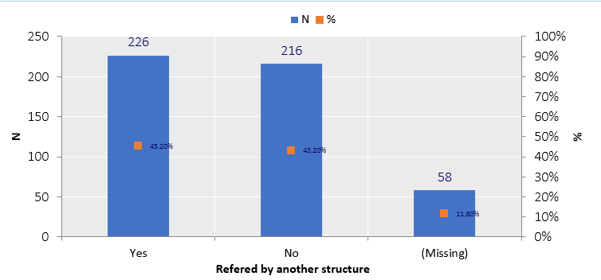
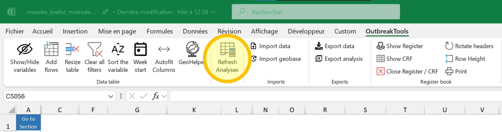
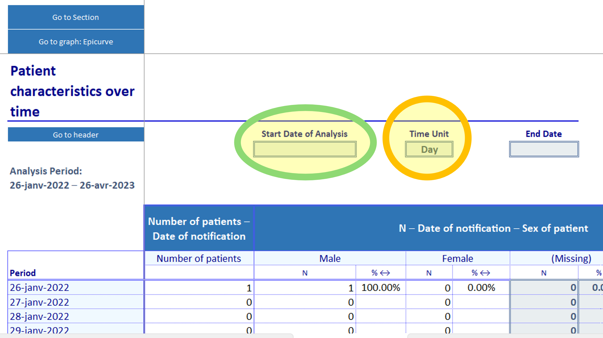
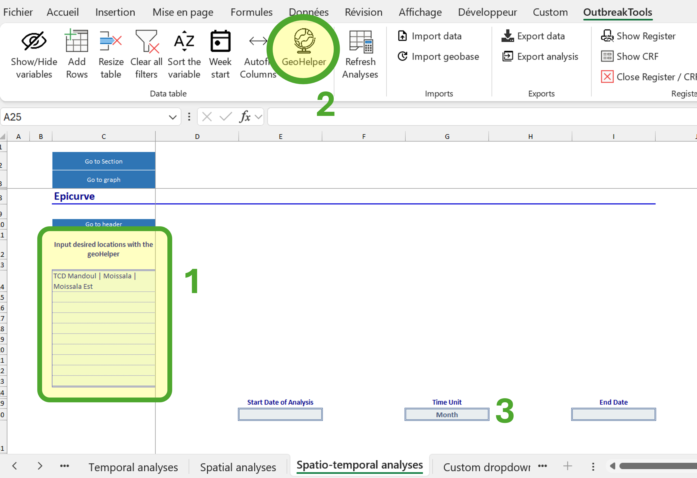

OBT linelist contain analyses sheets with basic exploration of the data. Which sheets, and their exact content vary between diseases and what was encoded in the dictionary, but you can expect some or all of the following:  

- Uni and bivariate analyses
- Temporal analyses (epicurves and their associated tables)
- Spatial analyses (top X residence of cases, or deceased patients)
- Spatio-temporal analyses (epicurves for locations of your choice)

{fig-align="center" height=100}

## Updating analyses

The most important thing to know is that you should update the analyses before looking at them:

1) Decide which data should be included in the analyses (see @imp-filters)

2) Hit **F9** (forced recalculation, in case some formula got stuck)

3) Hit the "Refresh button" in the [OutbreakTools menu](../reference/ribbons_linelist.qmd#sec-refresh), which will update all the data used by all the sheets.

{fig-align="center"}

::: {#imp-filters .callout-important}
If you **filter data** in the main patient sheet, it will be reflected in the analyses sheets *after you refresh* (a red warning will appear to remind you).
If you apply no filter or remove them, the analyses are performed on the whole dataset.
:::

## Person: Uni and bivariate analyses

This sheet is straightforward as there is nothing to parametrise on it: the tables and graphs are updated when you refresh the analyses.

::: {.callout-tip}
You can alter the appearance of the graphs on all the sheets^[Graphs and tables are created automatically and admittedly a bit ugly], the same way you would do for your own figures, with any [Excel tool](https://www.howtogeek.com/how-to-format-your-chart-in-excel/).

Note that graphs modifications will be lost during data migration to a new version of the linelist, so I advise you to restrict the modifications to graphs that you want to export to reports / slides, or which are _really_ making your eyes bleed.
:::

::: {.callout-tip}
All the analyses sheets have a blue button on the top left with a dropdown menu containing shortcuts to the sections, to facilitate navigation when the analyses are long.
:::

## Time: temporal analyses

This sheet contains tables across time and epicurves (below the tables). To see the analyses, you need to **select a time unit**: days, weeks, months, quarter, years. The table has 53 rows by default, and can thus accommodate up to:

- 53 days (start of the outbreak, or a zoom on a specific period)
- 53 weeks (aka one year)
- 53 months (if you have several years worth of data)
- 53 quarters or years (rarer user case of OBT, at least for linelists)

By default the table starts at the first admission/visit/notification date present in your data, but you can zoom on a specific time period by filling a start and even an end date of analysis. 

{fig-align="center"}

## Place: spatial analyses

The "Spatial analyses" sheet displays the **top X areas** with the most cases, where X is defined in the linelist dictionary^[Depending on the disease, it might be the top 10 places, or the top 30 places.].

Some linelists may have several such analyses, depending on the information available in the linelist:

- Top X areas of residence
- Top X areas of origin
- Top X areas of residence of deceased patients
- etc. 

To see data on this sheet you need to **select the admin level** at which you want to see the data displayed (blue button, admin 1 to 4). If you imported a geobase, you should see the names of the administrative levels from the geobase appear in the dropdown menu.

*If there is population data that you trust* in the geobase, you can use the button "Select if you want to divide by population" to show attack rates instead of number of cases^[If you elect to show attack rates when there is no population data, you will obtain errors in the table.].

:::{.callout-note}
If you have population data that is not in the geobase for levels of interest, or wish to correct existing ones, you can enter them in the "Geo" sheet (at the end of the linelist sheets).
:::

## Place and person: spatio-temporal analyses

The last analysis sheet that you may encounter in an OBT linelist is a crossover between the temporal analysis and the spatial analysis: it allows you to look at the number of cases (usually) for a couple of chosen administrative levels across time.

To use the sheet:

1) Place your cursor in one of the blue cells on the left (starting from C14 and down).

2) Click on the “GeoHelper” button in the [OutbreakTools menu](../reference/ribbons_linelist.qmd#sec-geo-helper)^[Or hit CTRL + G keys.] and select an administrative level of interest (could be from any level)

3) If you want to, go to the next blue cell and use the Geohelper to select another place of interest

4) Select a unit for the analysis (day/month etc.)

{fig-align="center"}

You can track as many locations as there are blue cells (this number may vary between diseases).

## Extra analysis: pivot table

An additional analyses sheet is available to create pivot tables ("Custom table"). In this sheet, there is one pivot table per existing linelist sheet in the workbook (usually, one). It works as regular pivot table, except the source is pre-defined.