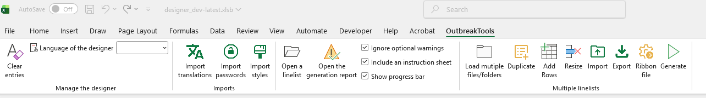
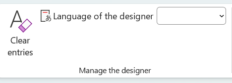
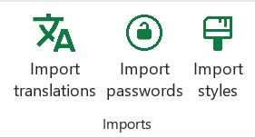
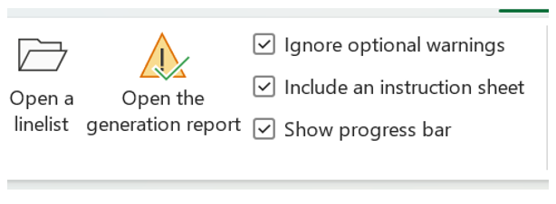
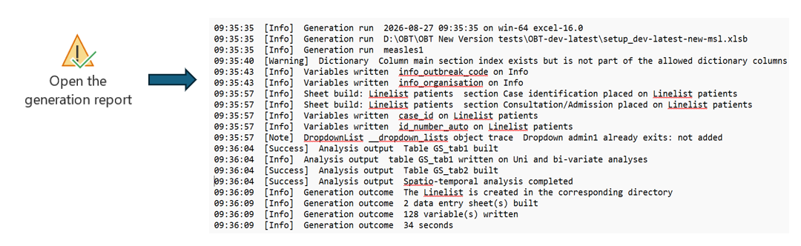
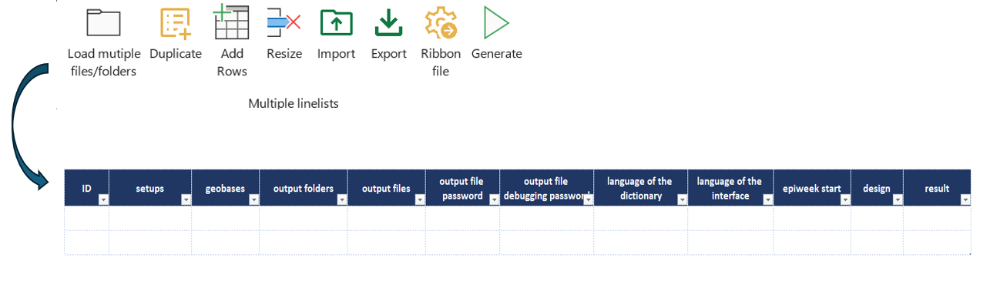
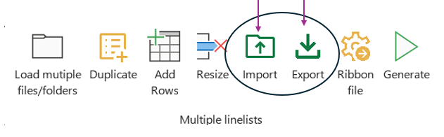

Recent version of Excel have a top [ribbon/menu](https://www.ablebits.com/office-addins-blog/excel-ribbon-guide/) that displays most buttons and functionalities in several tabs. Outbreaktools files (setup, designer and linelists) each have an extra tab in this menu containing OutbreakTools functionalities.

{fig-align="center"}

## Manage the designer

### Clear entries

Clear all fields from user-entered data.

### Language of the designer

Use the dropdown menu to change the language of the designer interface. Available languages: English, French, Arabic, Spanish and Portuguese.

## Imports

### Import translations

If the user wishes to modify the linelist interface translations, it is possible to ask for the config file to EpiDS/Yves Amevoin, tweak it and import it with this button.

### Import passwords

The designer is loaded with a password table, with private and public keys to protect exports (when some exports are configured to be password protected). However, the designer is on Github, in a public repo, so if you compile a linelist that needs a password protection, it is best to ask for the config file to EpiDS/Yves Amevoin and import it using the "Import password" button.

### Import styles {#sec-setup-styles}

The designer comes with two default styles for linelist themes. It is possible to personalise it. To do that, ask for the config file to EpiDS/Yves Amevoin, tweak it and import it with this button.

## Linelist generation

### Open a linelist

This button is used as a shortcut to opening a linelist.

### Open the generation report

The generation report is a log of the linelist generation.It lists the details of the generation run:

- Run details: the date, time and the setup file used.
- Build steps: each sheet that was built, with its sections.
- Analysis output: Analysis tables and charts built.
- Messages: Info, Note, success,warnings and errors.
- Final Outcome: The number of sheets built , the number of variables written and the total time taken

By clicking on this button, the user will be able to access the generation report  once the linelist has been generated. Alternatively it can also be found in the folder where the generated linelist has been saved.

## Generate Multiple 

The worksheet "Generate Multiple" provides an interface for generating multiple linelists in one go, from different setups and different geobases.

The buttons within the "Multiple Linelist" section of the ribbon are visible across the Designer, but they are only functional when the user is on the "Generate Multiple" sheet.

{fig-align="center"}

### Load multiple file/folders

This is used to load files into the setups, geobases and output columns. Before clicking the button, ensure the cursor is inside the data table area or else you will get an error message.

How this button works,place the cursor in a column (for example, Setup) and select your files. One line is filled for each file selected, starting from the cursor. To select several files at once, they must be in the same folder.If you select a single cell and choose only one file, only that cell is filled.

Also note that loading multiple files replaces any lines that are already filled. To keep existing lines and add new ones, click the add line buttons first, then load your files.

### Duplicate

You can duplicate a filled row and modify it according to what your interests are.

### Add Rows

Clicking this button will add more rows.

### Resize

Click on the “Resize" button to remove any empty rows at the end or in the middle of the worksheet.

## Import/Export

These buttons provide a way to import/export the content of the table from one Designer to another, which avoids the effort of having to re-enter all the data.

To do this, use the Export button to export everything in the table, and the Import button to bring it into the other Designer.

### Ribbon

This is used to load a **ribbon template file** in the designer. That file is necessary to generate a linelist with its own OBT menu, and is part of the `.zip` archive that you can dowload from Github if you want to build an OBT linelist.

### Generate
Once you have populated the sheet with all the required information, click the "Generate" button to start the generation process.

