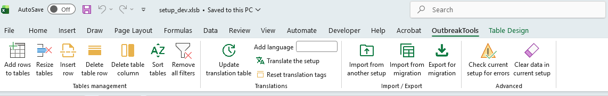
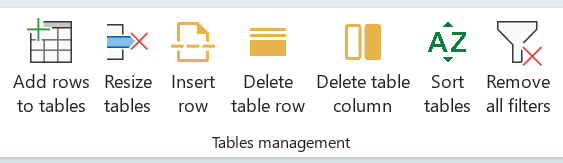
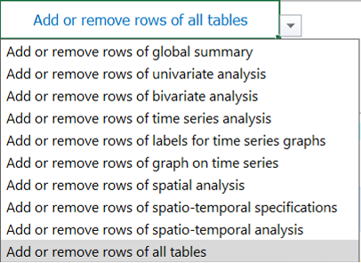
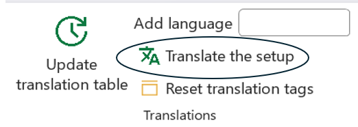
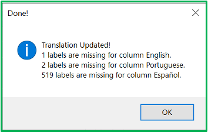
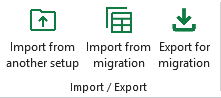
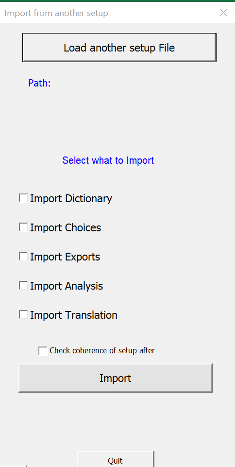
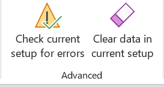
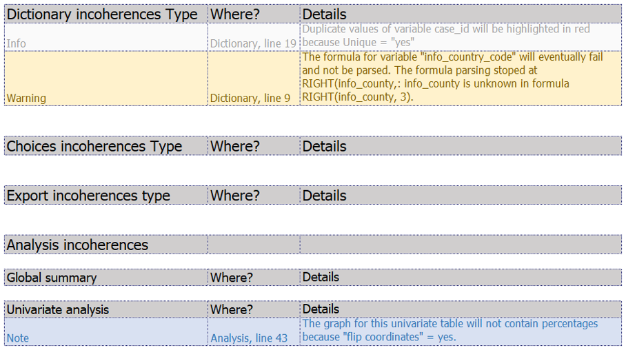
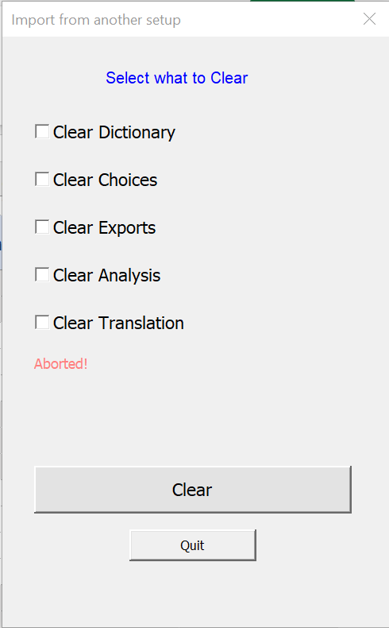

Recent version of Excel have a top [ribbon/menu](https://www.ablebits.com/office-addins-blog/excel-ribbon-guide/) that display most buttons and functionalities in several tabs. Outbreaktools files (setup, designer and linelists) each have an extra tab in this menu containing OutbreakTools functionalities.

{#fig-setup-ribbon fig-align="center"}

## Table management

The buttons of this section provide action on tables within the setup: main table on the *Dictionary sheet*, table for choices, table for exports, tables for analyses etc.

{fig-align="center"}

### Add rows to tables

This button inserts rows at the bottom of the table in the current sheet.

When this functionality is used in the *Analyses* sheet, you can use the drop-down menu in *cell A1* to choose whether you want to add rows to all tables or just one in particular.

{fig-align="center"}

### Resize tables

This button remove empty rows (whether at the end or in the middle).

When this functionality is used in the *Analyses* sheet, you can use the drop-down menu in *cell A1* to choose whether you want to remove empty rows to all tables or just one in particular.

{fig-align="center"}

### Insert row

This button inserts a row between existing rows in each of the setup's worksheets.

### Delete table row

This button deletes rows. To delete a row, select it and then click the button. Before the row is deleted, a warning message will appear to let you know that the operation cannot be undone.

### Delete table column

This button deletes table columns, but only on the Translation sheet.

### Sort tables

This button organises the Dictionary and the tables in the Choices, Analyses, and Export sheets. The sorting method depends on the sheet.

### Remove all filters

This button clears filters. It is usefull if you have applied Excel filters in several columns, no need to track them all one by one, just clear them in one go.

## Translation

This section provides functionalities for the [Translation sheet](../reference/translations_sheet.qmd).

{fig-align="center"}

### Add language

This button adds a new column to translations sheet, to add a new linelist language.

1. Fill the name of the language in the box
2. Click on the button: it will add a new empty column on the right of the columns already present.

[More information to add a language](../how_to/add_language.qmd)

### Update translation table

Click on this button to update the whole translation table. You can use it whether there is only one language or more.

The script will scrap the setup and import all the fields to be translated into the table, listed in alphabetical order.

At the end, it will open a popup window with information on the update of the translation table.

{fig-align="center"}

Go to the [Translation sheet](../reference/translations_sheet.qmd) for more information on translations.

## Import/ Export

These buttons allow users to import a setup file into an empty setup, as well as export it for migration.But first lets dissect

into the import buttons.

There are two ways to import a setup file:

- Import from another setup.

- Import from migration.

{fig-align="center"}

### Import from another setup

Use this button to import data from another **setup file** to an empty setup file^[An upgraded version, or an empty file for the same version in case the original file got corrupted.].
It lets users either select all the boxes to import everything, or choose only the specific items they want to import.

1. Click on the button; it opens a popup window
2. Click on the "Load another setup file" button. It will open a window to select the file to import data from.
3. Select what to import from the original by ticking the boxes.
4. Decide if you want to run a checkup of the **setup** file after import by ticking the box or not
5. Click on the "Import" button and wait.

{fig-align="center"}

::: {.callout-note}
If you are importing a setup to a new **setup file**, you should check all boxes to import everything.

You can run the coherence checks now, or do it at a later stage with the [Check setup button](#sec-check-setup)
:::

### Import from migration

This button allows users to import back the previously exported xlsx. 

### Export for migration

You can export the setup to xlsx and import it back, using the flat file as an intermediate format.

Flat files are easy to modify,so you can update your dictionary or edit it from R.

They're also easier to work with in the designer: they open and close faster, there's less juggling of the setup xlsb, and the setup is less likely to be corrupted during generation.  

## Advanced {#sec-advanced}

{fig-align="center"}

### Check current setup for errors {#sec-check-setup}

The **setup file** comes with a series of checks on its content to help you debug your dictionary. After adding major components to your **setup file**, or before compiling a linelist with the designer, you ~~can~~ should click on the button "*Check current setup for errors*" to see any errors in the *"\_\_checkRep*" sheet.

There is a table for each sheet or section (in the case of analyses), with the following three columns:

-   **Incoherences Type** preceded by the name of the sheet,  

-   **Where?**, which shows the name of the sheet or section and the line where the incoherence is located,  

-   **Details**, which gives details of the incoherence.

There are several types information that could appear in the Incoherence column:

-   **Info** (in grey): this is not an inconsistency, but simply a piece of information about something that will not block the compilation of the linelist.    

-   **Warning** (in yellow): these are problems that need to be fixed because there is a real inconsistency or problem. It could be an error in a formula, for example.^[Note that the checkup does its best, but some formula errors can be missed and create problems in your formulas. Always test the calculated columns after compilation!]  

-   **Note** (in blue): this is something that has been defined in the setup, but will not be applied, and is therefore not blocking. For example, in the analyses, certain choices are contradictory by design, such as the display of percentages, which is not authorised when you choose to invert the display of the table (horizontal display instead of vertical).

{fig-align="center"}

### Clear data in current setup

This feature allows you to delete all the data entered in the **setup file**. 

1. Click on the button; it opens a popup window to decide which part of the setup you want to clear
2. Tick boxes to select sheets to clean
3. Click on the "Clear" button. It will open a window to ask you if you are very sure.

{fig-align="center"}

## Dev 

The dev tab is for the OBT developer and you can ignore it.
